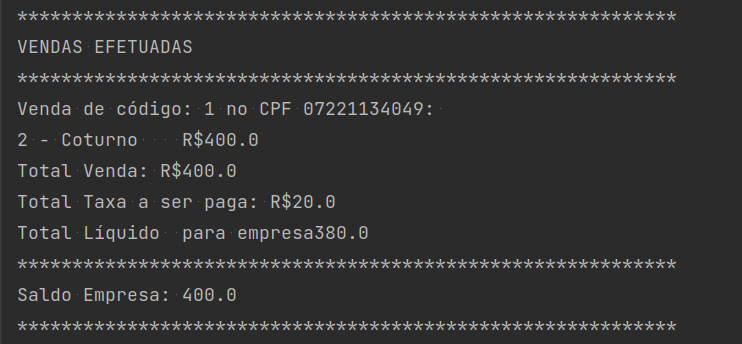
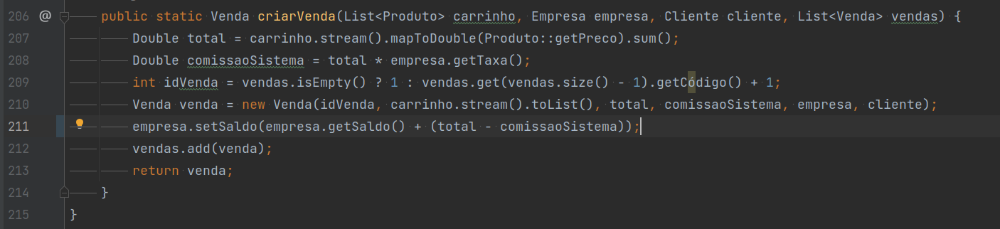
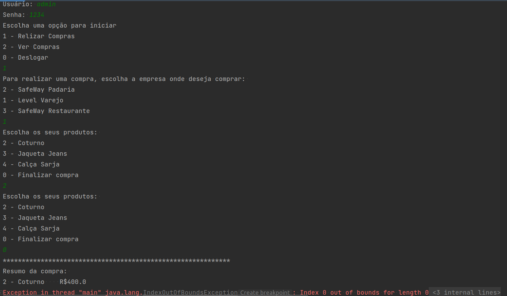
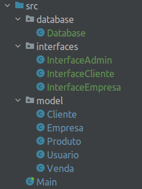
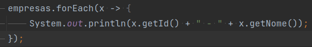
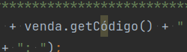

# teste-safeway

## Descrição

Este projeto foi desenvolvido para o processo seletivo da Safeway.

## Cenário

Uma empresa solicitou um sistema simples de compra. Nesse sistema o cliente pode fazer
compras em algumas empresas de acordo com os produtos que as mesmas têm disponível
em estoque, além disso ele também pode ver as suas compras. Por sua vez a empresa pode
ver as suas vendas e os seus produtos. 
Algumas das regras de negócios são: 

- Cada empresa tem sua taxa (comissão do sistema) para as transações;
- Além do administrador e a própria empresa, nenhum outro usuário poderá ver informações da empresa (além do nome);
- Ao finalizar uma compra o cliente deve ver um resumo da mesma;
- O saldo da empresa deve ser alterado já refletindo as taxas;
- A empresa deve vender apenas produtos que ela esteja relacionada;
- A empresa poderá ver a taxa de comissão de sistema em cada venda (ao listar suas
  vendas).

## Teste

1) Clone o projeto em sua máquina e descreva os erros que você encontrou.
   Obs.: Os erros podem ser desde código, estrutura de dados, boas práticas,
   experiência do usuário e regras de negócio.
2) Descreva como se estivesse repassando os ajustes para um programador.
3) Em caso de erros na regra de negócio, faça um relato para a empresa que solicitou o
   sistema, neste relato deve ser informando o erro e porquê acontece o erro.
4) Faça o máximo de ajustes no código, de forma que as falhas sejam corrigidas. Siga a
   seguinte ordem para o ajuste: regra de negócio, código, boas práticas, estrutura de
   dados e experiência do usuário.
5) Suba os ajustes no seu github (caso tenha feito apenas os descritivos, por favor
   desconsiderar).

## Erros encontrados

### Regra de negócio

##### Saldo da empresa não refletia as taxas

 
Ao chamar o método `setSaldo`, o valor da comissão do sistema é subtraído do total da compra.
 

##### Administrador não podia ver informações da empresa

Ao logar como administrador, não é possível ver as informações de nenhuma empresa.
Na verdade, a tela mostrada é a mesma de um usuário comum. Inclusive, ao tentar fazer
uma compra, o sistema retorna um erro. Pois, o administrador não possui o campo cliente preenchido na entidade usuario. 
 

Adicionei uma tela exclusiva para o administrador onde é possível listar empresas, produtos e vendas.

##### Era possível fazer uma compra com um produto que não estava em estoque

A quantidade do estoque não era verificada e nem atualizada ao finalizar a compra.
Adicionei uma verificação e exibição do estoque na seleção de itens na hora de comprar. Caso não esteja disponível, uma mensagem é exibida.

### Boas práticas

##### Banco de dados e entidades

Separei o mock do banco de dados em uma classe. Assim, pude utilizar o mesmo mock em qualquer método, sem precisar
passar como parâmetro cada lista de entidades quando fosse necessário. 
Com isso, pude remover todos os parâmetros de listas de entidades de todos os métodos, deixando o código muito mais
limpo. 

##### Código inteiro na Main

Acredito que o principal problema do código foi ter sido feito inteiramente em uma única classe, a Main. 
Isso dificulta a manutenção do código, pois, torna a leitura do código muito mais difícil,
o que pode gerar ainda mais bugs. 
Separei o código em classes, de acordo com cada interface que será exibida para cada tipo de usuário. Como
se a Main fosse um controller, que chama interfaces de acordo com o tipo de usuário.
Assim, o código possui uma leitura mais fácil, e fica mais fácil de identificar os erros e adicionar novas
funcionalidades. 

 

##### Classes não separadas por pacotes

Separei as classes que representam as entidades em um pacote chamado `model`, as classes que representam as interfaces
em um pacote chamado `interfaces` e o banco de dados em um pacote chamado `database`.

##### Má identação do código

Utilizei o próprio IntelliJ para identar o código, facilitando ainda mais a leitura.

##### Nome de variáveis e métodos não são intuitivos

 
Utilizei nomes mais intuitivos para as variáveis e métodos.

##### Nome dos métodos e variáveis possuem acentuação

 
Removi a acentuação dos nomes.

##### Obs
Além dos erros citados, também foram feitas algumas melhorias no código, como:
   - Alterei algumas funções para lambda;
   - Simplifiquei os switchs;
   - Adicionei espaços entre os blocos de código para facilitar a leitura.
  Tudo isso para deixar o código mais limpo e fácil de ler.

### Experiência do usuário

##### Era necessário logar novamente ao executar qualquer ação

Para resolver esse problema, adicionei um loop na tela inicial de cada usuário. Assim, o usuário não precisa
logar novamente a cada ação que deseja executar.

##### Alguns erros de digitação em mensagens para o usuário

## Conclusão

Após a correção dos erros, o sistema ficou muito mais fácil de usar. Além disso, o código ficou muito mais
limpo e fácil de ler, facilitando a manutenção e a adição de novas funcionalidades.

Optei por não alterar o nome das classes, métodos e variáveis para inglês, pois não sei se isso seria necessário
para esse projeto. 
Mas fica o observação que isso seria uma boa prática.

Obrigado pela oportunidade e espero que tenham gostado das soluções propostas e do código. 

Happy coding! :smile: